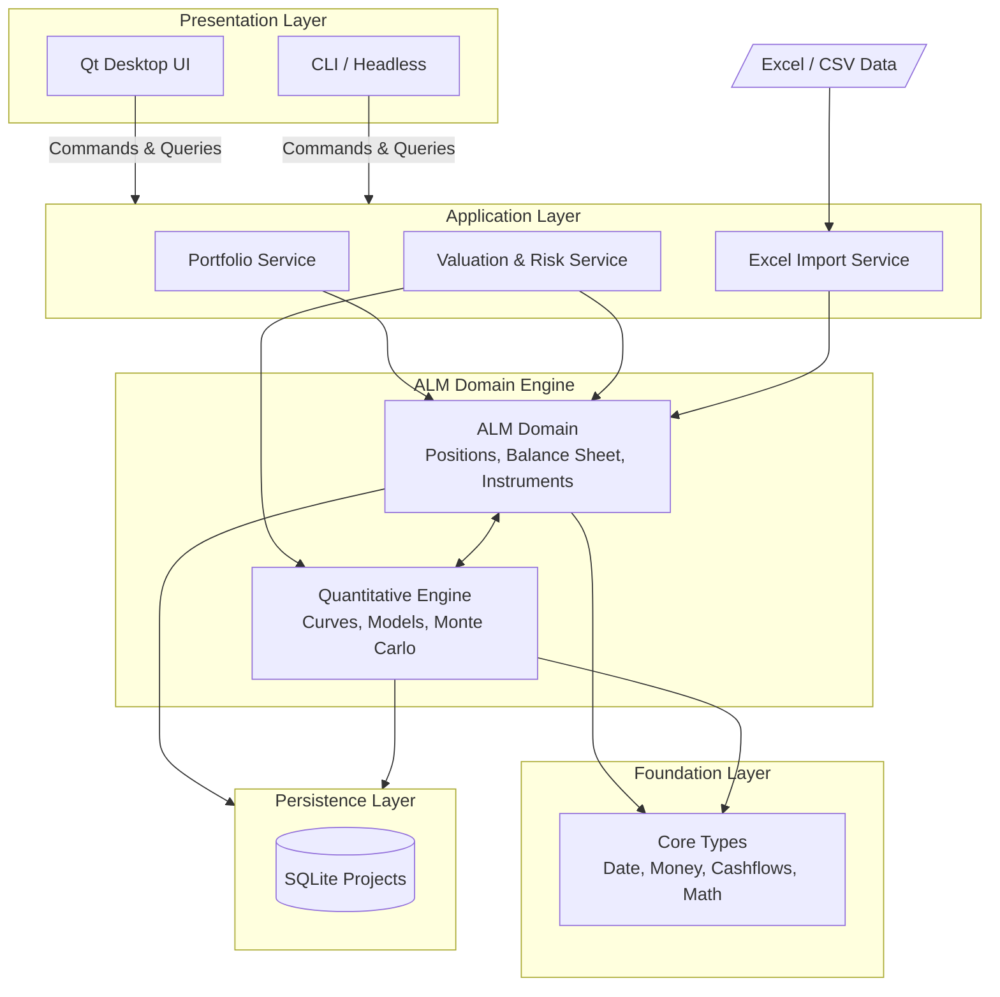

# ALM Workstation

An Asset Liability Management (ALM) application built in C++23.

This project is a high-performance, native desktop application built with a strict separation between the financial domain engine, quantitative models, and the user interface. By keeping the UI decoupled from the business logic, the application's core can easily be adapted for headless execution, automated testing, or command-line tools.

## Architecture

The architecture relies on a clean, layered design:



### Key Architectural Principles

1. **Decoupled UI**: The Qt frontend never performs financial calculations. It solely issues commands and queries to the Application Layer (`src/application/`).
2. **First-Class Domain Concepts**: Instruments and Positions are explicitly separated. An `Instrument` defines financial behavior and cash flows, while a `Position` represents ownership/quantity of an instrument.
3. **Composition over Inheritance**: Instead of deep, rigid class hierarchies (e.g., `CallableFixedBond`), financial instruments are modeled via composition (schedules, default models, amortization logic).
4. **Co-located Source and Header Files**: For maximum developer efficiency in this application structure, `.hpp` and `.cpp` files live side-by-side in their respective `src/` subdirectories.

## Directory Structure

The repository is organized as a CMake monorepo:

* `apps/` - Executable targets.
  * `alm-desktop/` - The Qt 6 graphical desktop application.
* `src/` - The ALM and Quantitative Engine. Built as a standalone, UI-free library.
  * `application/` - Application services bridging the UI and the domain.
  * `balance_sheet/`, `portfolio/`, `instruments/` - Domain logic.
  * `models/`, `simulation/`, `curves/`, `math/` - High-performance numerical and quantitative models.
  * `core/`, `time/` - Foundation types (Money, Date, Calendars).
* `ui/` - Qt-specific views, widgets, and view-models.
* `tests/` - Unit tests mirroring the exact directory structure of `src/`.
* `data/` - Static data, configuration, or sample SQLite files.
* `third_party/` - External dependencies (if not managed by a package manager).

## Building the Project

This project uses modern CMake and requires a C++23 compliant compiler.

### Prerequisites
* CMake 3.24+
* A C++23 capable compiler (GCC 13+, Clang 16+, or MSVC 19.38+)
* Qt 6.x

### Build Instructions

```bash
# 1. Generate the build files
cmake -B build -S .

# 2. Build the project
cmake --build build --parallel

# 3. Run the desktop application
./build/apps/alm-desktop/alm-desktop
```
